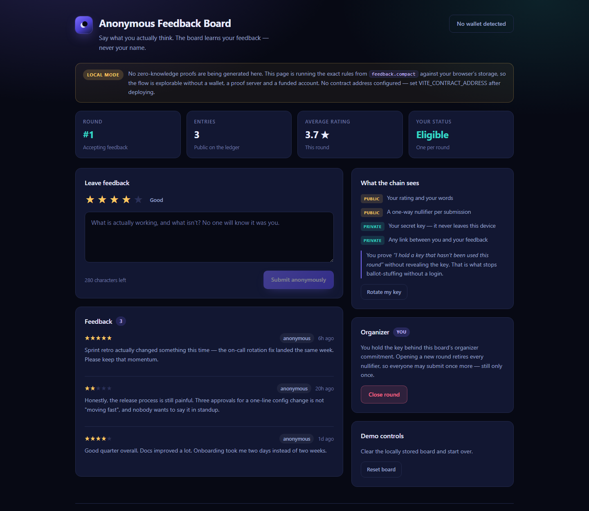
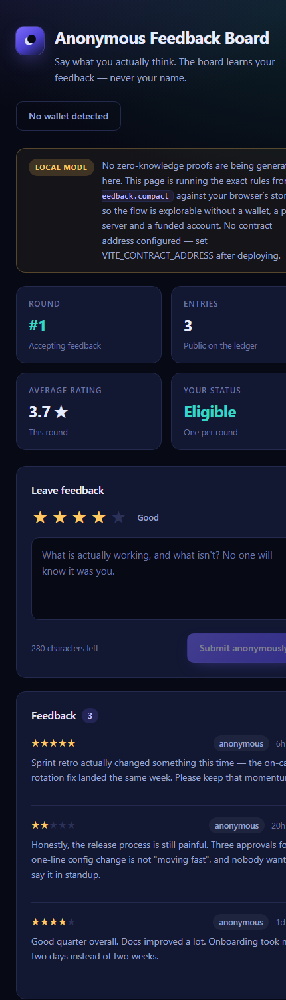

# Anonymous Feedback Board

A zero-knowledge feedback board on the [Midnight Network](https://midnight.network). Anyone can leave honest
feedback exactly once per round — and prove it's their first time without revealing who they are.

Built for the Midnight Builder Challenge. Project idea #8 (*Anonymous Feedback Board*) from the official list.



---

## Contract Address

Deployment is a manual step (see [Manual Deployment](#manual-deployment)).

| Network | Contract Address                     |
| ------- | ------------------------------------ |
| Preprod | `<YOUR_DEPLOYED_CONTRACT_ADDRESS>`   |

```env
CONTRACT_ADDRESS=<YOUR_DEPLOYED_CONTRACT_ADDRESS>
```

**Status: Pending** — not yet deployed. See [Build & toolchain status](#build--toolchain-status) for exactly
what was and wasn't verified on the build machine.

## Live Demo

| | |
| --- | --- |
| **Live app** | `<YOUR_VERCEL_URL>` — *pending deploy, see [Deploying the UI](#deploying-the-ui-to-vercel)* |
| **Repository** | `<YOUR_GITHUB_REPO_URL>` |

---

## What This Project Does

Collecting honest feedback has a trust problem. If people believe responses can be traced back to them, they
soften what they say. If you make it fully anonymous with no identity at all, one motivated person can submit
a hundred responses and skew the result.

This board fixes both ends with zero-knowledge proofs:

- Your feedback text and star rating are **public** — that's the point, everyone should read them.
- Your identity is **never published**. There is no account, no login, no wallet address attached to an entry.
- You still can't submit twice. Each submission publishes a **nullifier**: a one-way hash of your secret key
  and the round number. The contract rejects a nullifier it has already seen. It can tell "this key has been
  used" without being able to tell *whose* key it is, or link your round-1 entry to your round-2 entry.

An organizer can close a round and open a new one, which retires every nullifier so the same people may
submit again — still only once each.

## Features

- **One submission per person, per round**, enforced in-circuit by nullifier — no login required.
- **Unlinkable across rounds.** The nullifier is domain-separated by round, so entries can't be correlated.
- **Public feedback, private authorship.** Ratings and text land on the ledger; authorship never does.
- **Organizer controls** gated by a zero-knowledge proof of key ownership, not by an address allowlist.
- **Live average rating** and entry count computed from public ledger state.
- **Key rotation** — drop your local secret and become a completely fresh, unlinkable participant.
- **Wallet integration** with Lace Midnight Preview / 1AM via the DApp Connector API (v4).
- **Responsive UI** with explicit loading, busy and error states — failed circuit assertions surface as
  readable messages rather than console noise.
- **Runs without a wallet.** With no contract configured the UI executes the contract's own rules locally so
  the flow stays explorable; the mode is labelled in the UI, never disguised as a real transaction.

## Privacy Model

| | Data | Where it lives |
| --- | --- | --- |
| 🔓 **Public** | Star rating (1–5) | Ledger — `ratings` map |
| 🔓 **Public** | Feedback text | Ledger — `messages` map |
| 🔓 **Public** | Round number, entry count, open/closed | Ledger |
| 🔓 **Public** | One nullifier per submission | Ledger — `submitted` set |
| 🔓 **Public** | Organizer commitment (a hash) | Ledger — `organizer` |
| 🔒 **Private** | Your 32-byte secret key | Your device only — never in a transaction |
| 🔒 **Private** | The link between you and your entry | Never computed anywhere |

**What you prove without revealing it:** *"I know a secret key whose nullifier for this round has not been
published yet."* The proof is checked by the network; the key that makes it true never leaves your machine.

For organizer actions the claim is *"I know the secret key behind the stored organizer commitment"* — so the
organizer stays pseudonymous while still being the only one who can close a round.

## Tech Stack

| Layer | Technology |
| --- | --- |
| Smart contract | [Compact](https://docs.midnight.network) `language_version >= 0.23` |
| ZK runtime | `@midnight-ntwrk/compact-runtime` 0.16.0 |
| Integration | Midnight.js 4.1.1 (`midnight-js-contracts`, `-types`, `-protocol`, providers) |
| Wallet | `@midnight-ntwrk/wallet-sdk` 1.2.0 (CLI) · DApp Connector API v4 (browser) |
| Frontend | React 18 · TypeScript 5.9 · Vite 5 |
| Reactivity | RxJS 7 |
| Proving | `midnightntwrk/proof-server:8.1.0` (Docker, local) |
| Runtime | Node.js 22 |

## Folder Structure

```
.
├── contract/                     Compact smart contract + witnesses
│   ├── src/feedback.compact      the contract: ledger state, witness, circuits
│   ├── src/witnesses.ts          private state type + witness implementation
│   ├── src/index.ts              compiled-contract binding (CompiledContract.make)
│   └── src/managed/feedback/     generated by `npm run compact` (gitignored)
├── api/                          contract-interaction layer, shared by UI and CLI
│   ├── src/index.ts              FeedbackBoardAPI — deploy / join / call circuits
│   ├── src/browser-providers.ts  wallet-extension provider wiring
│   ├── src/common-types.ts       provider + derived-state types
│   └── src/config.ts             network endpoints, contract address
├── ui/                           React web app (this is what deploys to Vercel)
│   ├── src/board/client.ts       picks on-chain vs local execution
│   ├── src/board/engine.ts       the contract's rules, run in-browser
│   ├── src/board/wallet.ts       Lace / 1AM connector
│   └── src/components/           Composer, EntryList, StatCard, banners
├── feedback-cli/                 Node CLI: deploy and interact from a terminal
│   ├── src/deploy.ts             deploys the contract, prints the address
│   ├── src/index.ts              interactive board client
│   └── src/providers.ts          headless wallet + provider wiring
├── docs/                         screenshots
└── docker-compose.yml            proof server
```

## Prerequisites

- **Node.js 22+** (`node --version`)
- **Docker** — runs the proof server. Proving is local by design; private state never goes to a remote host.
- **Compact compiler** — install per the [official docs](https://docs.midnight.network). Verify with
  `compact --version`. *(Linux/macOS; on Windows use WSL2.)*
- **A Midnight wallet** — [Lace Midnight Preview](https://chromewebstore.google.com) or 1AM, funded from the
  [preprod faucet](https://midnight-tmnight-preprod.nethermind.dev/). Funding takes 2–3 minutes.

## Installation

```bash
git clone <YOUR_GITHUB_REPO_URL>
cd anonymous-feedback-board
npm install
```

## Compile

The Compact compiler generates the circuits, prover/verifier keys and the TypeScript contract binding into
`contract/src/managed/feedback/`. Everything else depends on this, so run it first.

```bash
npm run compact
```

> The first compile downloads roughly 500 MB of ZK parameters. Expect it to take a while.

## Build

```bash
npm run build
```

Builds `contract` → `api` → `ui` in dependency order.

To run the web UI on its own:

```bash
npm run dev
```

Then open http://localhost:3000.

## Manual Deployment

Deployment is intentionally **not** performed by the build. Start the proof server, fund a wallet, then:

```bash
docker compose up -d
```

```bash
MIDNIGHT_WALLET_SEED=<your-64-char-hex-seed> npm run deploy -- --network preprod
```

On a memory-constrained machine:

```bash
NODE_OPTIONS="--max-old-space-size=12288" npm run deploy -- --network preprod
```

## After Deployment

The only remaining steps are:

1. Deploy the Compact contract (above).
2. Copy the deployed contract address from the command output.
3. Replace every occurrence of `<YOUR_DEPLOYED_CONTRACT_ADDRESS>`:
   - `README.md` — the Contract Address table
   - `ui/.env` — `VITE_CONTRACT_ADDRESS`
   - your shell env — `CONTRACT_ADDRESS`, used by the CLI

No further code changes are required. The UI switches from local mode to on-chain mode automatically once
`VITE_CONTRACT_ADDRESS` is set to a real address.

## Environment Variables

| Variable | Used by | Purpose |
| --- | --- | --- |
| `VITE_CONTRACT_ADDRESS` | ui | Deployed board address. Placeholder ⇒ local mode. |
| `VITE_NETWORK_ID` | ui | `undeployed` \| `preview` \| `preprod`. Default `preprod`. |
| `VITE_PROOF_SERVER_URL` | ui | Local proof server. Default `http://127.0.0.1:6300`. |
| `CONTRACT_ADDRESS` | cli | Board to join. |
| `MIDNIGHT_WALLET_SEED` | cli | 64-char hex seed of a funded wallet. **Never commit this.** |
| `MIDNIGHT_NETWORK` | cli | Overrides the `--network` flag. |
| `PRIVATE_STATE_PASSWORD` | cli | Encrypts the local private-state store (min. 16 chars). |

Copy `ui/.env.example` to `ui/.env` to get started.

## Deploying the UI to Vercel

The web app is a static Vite build and deploys with **Root Directory set to `ui`**.

```bash
npm i -g vercel
cd ui
vercel --prod
```

Set `VITE_CONTRACT_ADDRESS` and `VITE_NETWORK_ID` in the Vercel project's environment variables.

> A hosted deployment can only ever run in **local mode**. Real circuit calls need a proof server on
> `127.0.0.1` and a wallet extension — both live on the user's own machine. That's a property of Midnight's
> privacy model, not a limitation of this app.

## Screenshots

**Desktop — open round, organizer view**


**Mobile**



## Build & toolchain status

Honest account of what was verified on the machine this was built on (Windows 11, no Docker, no WSL distro):

| Step | Status |
| --- | --- |
| `ui` — `tsc --noEmit` | ✅ passes |
| `ui` — `vite build` | ✅ passes (158 kB bundle) |
| UI running end-to-end in a browser | ✅ verified — screenshots above are of the running app |
| `npm run compact` | ⚠️ **not run** — the Compact compiler is Linux/macOS-only and no WSL distro was available |
| `contract` / `api` / `feedback-cli` builds | ⚠️ **not run** — they import `contract/src/managed/`, which only exists after `npm run compact` |
| Contract deployment | ⚠️ **not run** — needs the proof server (Docker) and a funded wallet |

The contract and the TypeScript integration layer are written against the current Midnight stack
(Compact 0.23, Midnight.js 4.1.1) and follow the official `example-bboard` scaffold's patterns closely, but
**`feedback.compact` has not been through the compiler.** Expect to fix small syntax issues on your first
`npm run compact`.

## Troubleshooting

**`compact: command not found`** — the compiler isn't on your PATH. Follow the install steps in the Midnight
docs and re-check with `compact --version`. On Windows, run it inside WSL2.

**`Cannot find module './managed/feedback/contract/index.js'`** — you haven't compiled yet. Run
`npm run compact`.

**`Failed to connect to Proof Server` / `ECONNREFUSED 127.0.0.1:6300`** — start it with
`docker compose up -d`, then confirm with `docker ps`.

**`Not enough Dust` / `Insufficient Funds`** — your NIGHT hasn't generated DUST yet. Wait ~1 block and retry;
the deploy script already retries for you. If the balance is genuinely zero, fund the address from the faucet
and allow 2–3 minutes.

**`Could not find Midnight Lace wallet`** — install the extension, make sure it's enabled for the page, and
reload. The dApp requires connector API **v4.x**.

**UI shows "Local mode" when you expect on-chain** — `VITE_CONTRACT_ADDRESS` is unset or still the
placeholder. The banner shows the exact reason.

**Wallet has no funds after using the faucet** — funding takes 2–3 minutes to land, and the CLI polls for it.

## Initial Idea

> *(Placeholder — describe the original idea in your own words for the Rise In submission.)*
>
> Picked idea #8, *Anonymous Feedback Board*, from the official project list. The appeal was that it needs
> both halves of Midnight's model at once: the feedback has to be public to be useful, and the author has to
> be private for it to be honest — with a nullifier bridging the two so anonymity doesn't cost you
> one-person-one-vote.

## License

Apache-2.0
